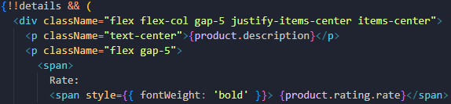

# Галерея продуктов на React, Typescript и Tailwind

**_Минималистичный SPA-проект получения с удаленного сервера и отображения списка карточек с CRUD-операциями_**

---

### Использован шаблон c-r-a --template typescript

Для первичной инициализации проекта в его директории сперва нужно установить зависимости с помощью команды:

```sh
npm install
```

Для локального запуска проекта нужно использовать команду

```sh
npm start
```

## В проекте использованы библиотеки

- [x] Typescript;
- [x] Tailwind;
- [x] React Router;
- [x] react-loader-spinner

Весь CSS реализован через служебные классы Tailwind, исключая пару точечных инлайновых стилей.  


Библиотека react-loader-spinner - минималистичная библиотека loader'ов (загрузчиков), готовых к использованию с возможностью небольшой кастомизации. Использована в компоненте Spinner'а.  


React Router использован для навигации между страницами **Home** / **Contacts** / **Not Found**
Рендер вложенных страниц реализован через компонент `<Outlet />` библиотеки `react-router-dom`

## Данные для проекта получаются из открытого API [fakestoreapi.com](https://fakestoreapi.com/)

Получение данных с удаленного сервера реализовано через нативный Fetch API.

В логике приложения выделены _транспортный_ и _логический_ слои:

- Транспортный слой вынесен в утилиту api.ts.  
  В нем реализуются только сами запросы к серверу.

- Работа с логикой вынесена в кастомные хуки.  
  Там же происходит обработка ответов сервера и отлов возможных ошибок.
  Состояние и функции открытия/закрытия модального окна вынесены в контекст (`createContext`).

Добавление товара в БД осуществляется также через POST-запрос. Возвращенный в ответе сервера объект сохраняется только в стейте списка продуктов. В реальности моковая БД не изменяется, соответственно при повторном запросе списка товаров от сервера ранее добавленные продукты не отобразятся, что является нормальным поведением.

При рендере карточек продуктов в качестве ключей списка использованы id товаров из БД, которые предполагаются уникальными. При этом тестовое АПИ [fakestoreapi.com](https://fakestoreapi.com/) при добавлении каждого товара возвращает одинаковый `id '21'`. Соответственно при добавлении через интерфейс приложения более одной единицы продукта библиотека react-router выдаст предупреждение о том, что ключи в списке продуктов дублируются, что является нормальным поведением.

---

Любые замечания по работе приложения приветствуются 😊
